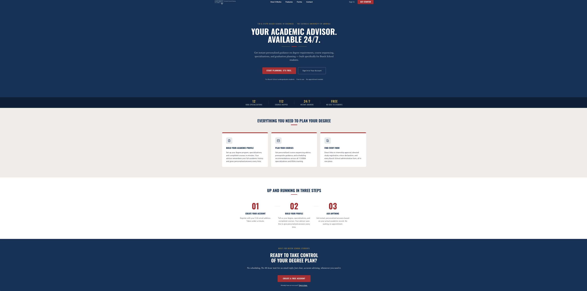
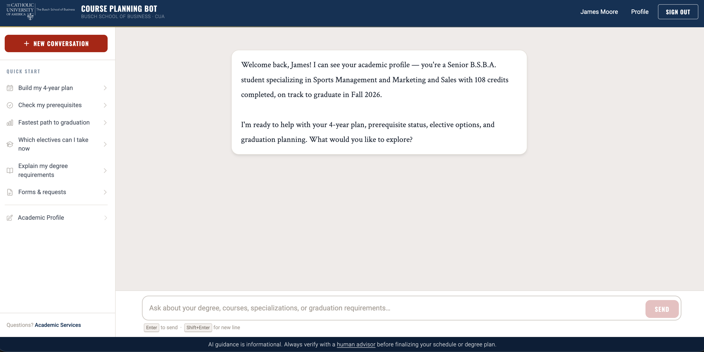

# Busch School Course Planning Bot

An AI-powered academic advising chatbot for undergraduate students at the **Tim & Steph Busch School of Business** at The Catholic University of America.

---

## What It Does

The Busch School Course Planning Bot is a conversational AI advisor that helps undergraduate business students plan their degrees without waiting for an appointment. Students register, complete a guided onboarding profile, and immediately receive personalized guidance on:

- Which degree requirements they have completed, are in progress, or still need
- A personalized semester-by-semester 4-year plan generated on demand
- Prerequisite conflicts — courses in progress whose prerequisites haven't been met
- Which electives a student can register for right now vs. which are still blocked
- The fastest path to graduation based on critical course chains and semester locks
- Exact credits remaining to graduation calculated from their actual course record
- All BSBA specializations, BS Accounting program, BA in Business (Double Major), and all 12 business minors
- How to register for internships, directed studies, and co-ops
- Where to find and submit Busch School administrative forms

No scheduling. No waiting 48 hours for a reply. The bot reads the student's saved academic profile and gives specific, actionable advice in seconds — available 24/7 at no cost to the student.

---

## Features

### Core Experience

- **Landing Page** — CUA-branded homepage with hero, feature cards, how-it-works steps, and CTA sections using official Catholic University brand colors and fonts
- **Login & Registration** — students register and sign in with their CUA email; restricted to `@cua.edu` addresses
- **AI Chat Interface** — clean, responsive conversation UI with full CUA branding (cardinal red, blue, gold; Oswald + Crimson Text fonts)
- **Forms & Requests Panel** — direct links to all Busch School Google Forms (internship approval, directed study, minor declaration, and more)
- **Sidebar Quick-Start Prompts** — one-click buttons for the most common advising questions; New Conversation button to reset the chat
- **Full Curriculum Context** — all 12 BSBA specializations, 112 courses with prerequisites, liberal arts requirements, elective rules, and catalog year differences loaded as AI context

### Student Academic Profile System

- **6-Step Onboarding Wizard** — supports all four degree paths: BSBA (full 6 steps), BS Accounting (dedicated accounting step instead of specializations), BA in Business Double Major (8-course reduced core + pair picker for 9 pairs A–I), and Business Minor (minor picker for all 12 business minors with required, double-count, and elective group tracking)
- **Academic Profile Page** — `/profile/academic` shows every required LA slot (15) and core slot including "not yet" rows, per-specialization blocks with elective lists, completion summary cards with progress bars, and transfer credit records
- **Bot-Driven Profile Updates** — bot can suggest marking a course as completed via a `[PROFILE_UPDATE]` tag; student sees a confirmation banner and clicks Accept to save the change
- **Semester Prompt Banner** — each September and January a gold banner prompts students to report new completions to keep their profile current

### Advanced AI Features (Milestone 8)

Every chat message is enriched with four context blocks computed live from the student's profile before being sent to the AI:

- **Prerequisite Conflict Detection** (`PrerequisiteService`) — checks all 112 Busch School courses against the student's completed courses, standing, and credit count. The AI is told which in-progress courses have unmet prerequisites (conflicts), which courses the student just became eligible for (now eligible), and which are still blocked and why.
- **4-Year Plan Generator** (`PlannerService`) — breaks down remaining requirements by category (business core, liberal arts, specialization required, specialization electives, career discernment) and passes them as a structured context block so the AI can generate a realistic semester-by-semester plan on demand.
- **Credits-to-Graduation Calculator** — counts actual remaining required courses and multiplies by their credit value (3 cr, 1 cr, or 0 cr depending on the course). Far more accurate than a flat estimate because it knows exactly which slots are filled.
- **Elective Suggestions** — for each of the student's specializations, shows which elective pool courses can be registered for right now vs. which are still prereq-blocked. The AI surfaces this immediately so students know their actual options.
- **Fastest Path to Graduation** — identifies the five critical sequential chains (Core Gateway, Finance, Accounting, Marketing, Sales), finds which steps remain, flags semester-locked courses (Fall-only or Spring-only), and estimates the minimum number of semesters to finish.

### Design & Access

- **Consistent Design System** — all pages use official CUA brand colors (`#0a3255`, `#b21f2c`, `#C9A84C`), self-hosted fonts (Oswald, Roboto, Crimson Text — no Google CDN), and matching layout patterns
- **Accessibility** — high-contrast text throughout all dark sections; nav logo inverted to white on dark header
- **CUA Email Restriction** — registration and login are restricted to `@cua.edu` addresses; non-CUA emails are rejected with a clear error message

---

## Tech Stack

| Layer | Technology |
|-------|-----------|
| Backend | Laravel 13 (PHP 8.5) |
| Database | SQLite |
| Frontend | Blade templates, Tailwind CSS v3, Alpine.js v3 |
| AI | Groq API — `llama-3.3-70b-versatile` |
| Build tool | Vite |
| Auth | Laravel Breeze |
| Hosting | AWS EC2 |

---

## Live URL

**https://buschcourseplanner.dev**

**http://44.197.180.244**

The app is deployed on AWS EC2. The custom domain `buschcourseplanner.dev` has been purchased and points to the live server. Register an account and start chatting.

---

## Screenshots

### Landing Page


### Onboarding Wizard


### AI Chat Interface


### Academic Profile Page


---

## How to Run Locally

### Prerequisites

- PHP 8.5+
- Composer
- Node.js 20+ and npm
- A [Groq API key](https://console.groq.com) (free tier works)

### Setup

```bash
# 1. Clone the repository
git clone https://github.com/moorejp-coder/CUA-CoursePlanner.git

# 2. Enter the project directory
cd CUA-CoursePlanner

# 3. Install PHP dependencies
composer install

# 4. Copy the environment file
cp .env.example .env

# 5. Generate the application key
php artisan key:generate

# 6. Create the SQLite database file
touch database/database.sqlite

# 7. Run database migrations
php artisan migrate

# 8. Run the database seeder
php artisan db:seed

# 9. Install Node dependencies and build frontend assets
npm install && npm run build

# 10. Add your Groq API key to .env
#    Open .env and set: GROQ_API_KEY=gsk_your_key_here

# 11. Start the development server
php artisan serve

# 12. Visit the app
open http://127.0.0.1:8000
```

Register an account with a `@cua.edu` email, complete the onboarding wizard, and start chatting. For live asset rebuilding during development, run `npm run dev` in a separate terminal instead of step 9.

---

## Environment Variables

Copy `.env.example` to `.env` and set the following:

```env
GROQ_API_KEY=gsk_your_key_here   # required — get one free at console.groq.com

# Required only if you run `php artisan db:seed`
ADMIN_SEED_EMAIL=you@cua.edu
ADMIN_SEED_NAME=Admin
ADMIN_SEED_PASSWORD=YourStrongPassword123!
```

All other variables in `.env.example` can be left at their defaults for local development. **Never commit `.env` to version control.**

---

## Security

The following protections are implemented:

| Layer | Protection |
|-------|-----------|
| HTTPS / HSTS | HSTS enforced in production (`max-age=31536000; includeSubDomains`); session cookies auto-HTTPS |
| HTTP headers | `X-Frame-Options: DENY`, `X-Content-Type-Options: nosniff`, `Referrer-Policy: strict-origin-when-cross-origin`, `Permissions-Policy` (all unused browser APIs disabled), `Content-Security-Policy` (self-only; no external CDN allowances) |
| Session cookies | HTTPS-only (`secure: auto`), `HttpOnly`, `SameSite=Strict` |
| API rate limiting | 20 req/min on `/api/chat`; 5 req/min on login and register (IP + user-ID keyed; brute-force protection) |
| Input validation | Messages stripped of HTML tags, max 2,000 chars; API response field allowlists enforced |
| Passwords | Min 8 chars, mixed case, at least one number; HIBP breach check (k-anonymity) on all set/change flows |
| Secrets | `GROQ_API_KEY` and `APP_KEY` in `.env` only — never in code, logs, or API responses |
| CSRF | Laravel CSRF tokens on all POST/PATCH/DELETE routes |
| GDPR / account deletion | Full data wipe (user row, academic profile, courses, sessions, remember tokens) on account deletion |
| Font privacy | Fonts self-hosted in `/public/fonts` — no Google Fonts CDN; student IPs never sent to Google |
| Dependency security | `composer audit` clean — all known CVEs patched (11 Symfony vulnerabilities patched May 2026) |
| Attack pattern detection | `DetectAttackPatterns` middleware blocks SQL injection, XSS probes, null bytes, and oversized payloads |
| UUID primary keys | User IDs are UUIDs — sequential ID enumeration is not possible |
| XSS (chat output) | Alpine.js `x-html` removed from chat UI; bot output rendered as plain text, not HTML |
| Seeder security | Admin seed credentials read from env vars at `db:seed` time; no hardcoded fallbacks in source code |

---

## Project Structure

```
CUA-CoursePlanner/
├── app/
│   ├── Http/
│   │   ├── Controllers/
│   │   │   ├── ChatController.php            # GET /chat, POST /api/chat → Groq API
│   │   │   ├── OnboardingController.php      # 6-step academic profile wizard
│   │   │   └── AcademicProfileController.php # Profile page + bot update API
│   │   └── Middleware/
│   │       ├── SecurityHeaders.php           # CSP, X-Frame-Options, HSTS, etc.
│   │       ├── DetectAttackPatterns.php      # SQLi/XSS/null-byte blocking
│   │       └── ValidateSessionBinding.php   # UA/IP change → session invalidation
│   └── Services/
│       ├── PrerequisiteService.php           # Checks 112 courses; conflict + eligibility analysis
│       └── PlannerService.php                # Remaining requirements, elective suggestions, fastest path
├── resources/
│   └── views/
│       ├── chat.blade.php               # Main chat UI (Alpine.js, Tailwind)
│       ├── onboarding/                  # 6 wizard step views (step1–step6 + step_accounting)
│       └── profile/academic.blade.php   # Read-only academic profile page
├── routes/
│   └── web.php                          # All application routes
├── storage/
│   └── app/
│       ├── system_prompt.txt            # Full Busch School curriculum + AI generation rules
│       └── requirements.json            # All degree requirements, prereqs, specializations (per catalog year)
├── public/
│   ├── build/                           # Vite-compiled CSS and JS (gitignored)
│   └── fonts/                           # Self-hosted woff2 files (Oswald, Roboto, Crimson Text)
├── tests/
│   └── Feature/
│       ├── SecurityHeadersTest.php      # HTTP security headers assertions
│       ├── PrerequisiteServiceTest.php  # 18 tests for prerequisite conflict/eligibility logic
│       └── ...                          # Auth, onboarding, profile, rate-limiting, GDPR tests
├── deploy.sh                            # AWS EC2 deployment script
├── ROADMAP.md                           # Milestone plan and open issues
├── FUTUREUPDATES.md                     # Deferred features and re-enable instructions
└── .env                                 # Local secrets (gitignored)
```

---

## Contest Info

This project is submitted to the **CUA AI Vibe Coding Competition 2026**. It is being built iteratively with public commits on GitHub to demonstrate a realistic development process from scaffold to production.

See [ROADMAP.md](ROADMAP.md) for the full milestone plan and success criteria.

---

## Problem & Solution

**Problem:** Busch School undergraduates lack immediate, reliable access to personalized academic advising. Scheduling an advisor appointment or waiting for an email reply can take 24–72 hours — a real barrier during course registration, add/drop periods, and graduation planning.

**Solution:** An AI advisor that reads the student's saved academic profile and answers degree-planning questions instantly, accurately, and in plain language — available 24/7 at no cost to the student. Students complete a one-time onboarding wizard, and the bot knows their exact degree, catalog year, specializations, completed courses, standing, and credits from that point forward. It can generate a personalized 4-year plan, detect prerequisite conflicts, identify electives available to register for right now, and calculate the fastest path to graduation — all without the student having to ask twice.
